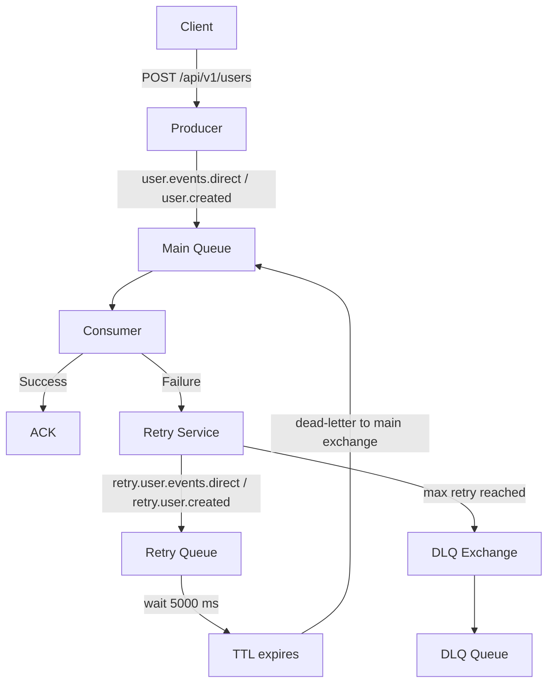

> Language / Dil: [AZ](#az) | [EN](#en)

## AZ

# RabbitMQ Example

Bu repo RabbitMQ ilə bağlı sadə nümunələri göstərən demo layihədir. Məqsəd producer, consumer və queue/exchange məntiqini praktik formada göstərməkdir.

Repo daxilində nümunələr branch-lər üzrə ayrılıb. Hər branch ayrıca bir RabbitMQ ssenarisini göstərir.

- exchange növləri üçün ayrıca nümunələr var
- `retry` və `DLQ` mövzuları üçün ayrıca nümunələr var
- hazırkı branch `retry-dlq-mechanism` ssenarisini göstərir

## Tech Stack

- Java 21
- Spring Boot 3.5.13
- Spring AMQP
- RabbitMQ
- Docker Compose

## Bu Branch Nə Göstərir

Bu branch `retry` və `DLQ` mexanizmi nümunəsidir.

Axın belədir:

1. Client `POST /api/v1/users` endpoint-inə request göndərir
2. tətbiq `UserCreatedEvent` yaradır
3. message `user.events.direct` exchange-inə `user.created` routing key ilə göndərilir
4. message `notification.user-created` queue-suna düşür
5. consumer message-i emal etməyə çalışır
6. emal uğursuz olsa message `retry.user.events.direct` exchange-inə göndərilir
7. message `notification.user-created.retry` queue-sunda `5000 ms` gözləyir
8. TTL bitəndən sonra message yenidən əsas queue-ya qaytarılır
9. retry sayı `3`-ə çatanda message `notification.user-created.dlq` queue-suna göndərilir

## Diaqram



## RabbitMQ Konfiqurasiyası

- Main exchange: `user.events.direct`
- Retry exchange: `retry.user.events.direct`
- DLQ exchange: `dlq.user.events.direct`
- Main routing key: `user.created`
- Retry routing key: `retry.user.created`
- DLQ routing key: `dlq.user.created`
- Main queue: `notification.user-created`
- Retry queue: `notification.user-created.retry`
- DLQ queue: `notification.user-created.dlq`
- Retry TTL: `5000 ms`
- Max retry count: `3`
- RabbitMQ port: `5672`
- RabbitMQ UI port: `15672`
- Application port: `8080`

## Necə İşə Salmaq Olar

### 1. RabbitMQ-nu başladın

```bash
docker compose up -d
```

### 2. Tətbiqi başladın

```bash
./gradlew bootRun
```

## Test Request

```bash
curl -X POST http://localhost:8080/api/v1/users \
  -H "Content-Type: application/json" \
  -d '{"id":1,"username":"Hilal"}'
```

## Gözlənilən Nəticə

- `username` dəyəri `Hilal` olarsa message uğurla emal olunur
- başqa dəyər gələrsə message retry queue-ya göndərilir
- hər retry cəhdində `x-retry-count` artırılır
- retry limiti bitəndə message DLQ-ya düşür

Retry və DLQ ssenarisini yoxlamaq üçün:

```bash
curl -X POST http://localhost:8080/api/v1/users \
  -H "Content-Type: application/json" \
  -d '{"id":2,"username":"hilal"}'
```

## Qeyd

Bu branch-də consumer manual ack istifadə edir.

- uğurlu emalda message `ack` olunur
- uğursuz emalda da message `ack` olunur, sonra kod səviyyəsində retry və ya DLQ-ya publish edilir
- DLQ message-lərində `x-final-retry-count` və `x-failed-at` header-ləri yazılır
- əgər message `ack` olunduqdan sonra retry və ya DLQ publish əməliyyatı uğursuz olsa, message itə bilər; bu riski azaltmaq üçün `publisher confirm`, `transaction` və ya `outbox pattern` kimi əlavə qurtarma mexanizmləri tətbiq oluna bilər
- DLQ ayrıca consume edilərək notification, alert və ya monitoring axını qurmaq mümkündür

## RabbitMQ UI

- URL: [http://localhost:15672](http://localhost:15672)
- username: `guest`
- password: `guest`

## EN

# RabbitMQ Example

This repo is a simple demo project for RabbitMQ examples. Its purpose is to show producer, consumer, queue, and exchange behavior in a practical way.

Examples in this repository are separated by branches. Each branch demonstrates a different RabbitMQ scenario.

- separate examples exist for exchange types
- separate examples exist for `retry` and `DLQ`
- the current branch demonstrates the `retry-dlq-mechanism` scenario

## Tech Stack

- Java 21
- Spring Boot 3.5.13
- Spring AMQP
- RabbitMQ
- Docker Compose

## What This Branch Shows

This branch demonstrates a `retry` and `DLQ` mechanism example.

Flow:

1. The client sends a request to `POST /api/v1/users`
2. the application creates a `UserCreatedEvent`
3. the message is published to `user.events.direct` with the `user.created` routing key
4. the message is routed to the `notification.user-created` queue
5. the consumer tries to process the message
6. if processing fails, the message is sent to the `retry.user.events.direct` exchange
7. the message waits in the `notification.user-created.retry` queue for `5000 ms`
8. after TTL expires, the message is routed back to the main queue
9. when the retry count reaches `3`, the message is sent to the `notification.user-created.dlq` queue

## Diagram


## RabbitMQ Configuration

- Main exchange: `user.events.direct`
- Retry exchange: `retry.user.events.direct`
- DLQ exchange: `dlq.user.events.direct`
- Main routing key: `user.created`
- Retry routing key: `retry.user.created`
- DLQ routing key: `dlq.user.created`
- Main queue: `notification.user-created`
- Retry queue: `notification.user-created.retry`
- DLQ queue: `notification.user-created.dlq`
- Retry TTL: `5000 ms`
- Max retry count: `3`
- RabbitMQ port: `5672`
- RabbitMQ UI port: `15672`
- Application port: `8080`

## How To Run

### 1. Start RabbitMQ

```bash
docker compose up -d
```

### 2. Start the application

```bash
./gradlew bootRun
```

## Test Request

```bash
curl -X POST http://localhost:8080/api/v1/users \
  -H "Content-Type: application/json" \
  -d '{"id":1,"username":"Hilal"}'
```

## Expected Result

- if `username` is `Hilal`, the message is processed successfully
- for other values, the message is sent to the retry queue
- the `x-retry-count` header is incremented on each retry
- when the retry limit is reached, the message is moved to the DLQ

To test the retry and DLQ scenario:

```bash
curl -X POST http://localhost:8080/api/v1/users \
  -H "Content-Type: application/json" \
  -d '{"id":2,"username":"hilal"}'
```

## Note

This branch uses manual acknowledgment in the consumer.

- on success, the message is acknowledged
- on failure, the message is also acknowledged and then explicitly republished to retry or DLQ in application code
- DLQ messages include the `x-final-retry-count` and `x-failed-at` headers
- if the message is acknowledged but publishing to retry or DLQ fails afterward, the message can be lost; to reduce that risk, additional recovery mechanisms such as publisher confirms, transactions, or the outbox pattern can be used
- the DLQ can be consumed separately to trigger notifications, alerts, or monitoring workflows

## RabbitMQ UI

- URL: [http://localhost:15672](http://localhost:15672)
- username: `guest`
- password: `guest`
