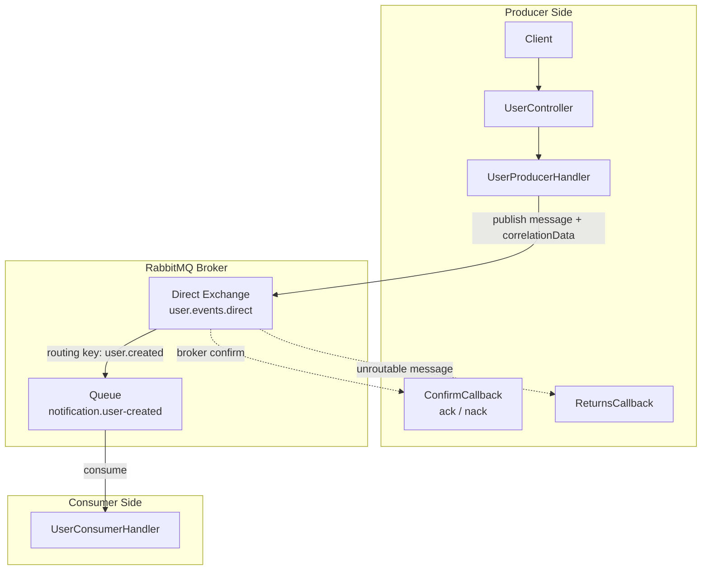

> Language / Dil: [AZ](#az) | [EN](#en)

## AZ

# RabbitMQ Example

Bu repo RabbitMQ ilə bağlı sadə nümunələri göstərən demo layihədir. Məqsəd producer, consumer və queue/exchange məntiqini praktik formada göstərməkdir.

Repo daxilində nümunələr branch-lər üzrə ayrılıb. Hər branch ayrıca bir RabbitMQ ssenarisini göstərir.

- exchange növləri üçün ayrıca nümunələr var
- `retry` və `DLQ` mövzuları üçün ayrıca nümunələr var
- hazırkı branch `publish-acknowledgment` ssenarisini göstərir

## Tech Stack

- Java 21
- Spring Boot 3.5.13
- Spring AMQP
- RabbitMQ
- Docker Compose

## Bu Branch Nə Göstərir

Bu branch RabbitMQ üzərindən `publish acknowledgment` nümunəsini göstərir.

## Flow



Axın belədir:

1. Client `POST /api/v1/users` endpoint-inə request göndərir
2. tətbiq request-dən `UserCreatedEvent` yaradır və `X-USER-ID` header-i əlavə edir
3. producer message-i `CorrelationData` ilə birlikdə `user.events.direct` exchange-inə `user.created` routing key ilə göndərir
4. message `notification.user-created` queue-suna route olunur
5. broker publish əməliyyatı üçün producer-ə `ack` və ya `nack` qaytarır
6. əgər message route olunmursa, `returns callback` işləyir
7. consumer message-i qəbul edir və log-a yazır

Bu nümunədə acknowledgment broker-dən producer-ə gəlir. Bu, consumer-in message-i emal etməsini yox, message-in broker-ə qəbul olunmasını təsdiqləyir.

## RabbitMQ Konfiqurasiyası

- Exchange: `user.events.direct`
- Routing key: `user.created`
- Queue: `notification.user-created`
- RabbitMQ port: `5672`
- RabbitMQ UI port: `15672`
- Application port: `8080`

## Necə İşə Salmaq Olar

### 1. RabbitMQ-nu başladın

```bash
docker compose up -d
```

### 2. Tətbiqi başladın

```bash
./gradlew bootRun
```

## Test Request

```bash
curl -X POST http://localhost:8080/api/v1/users \
  -H "Content-Type: application/json" \
  -d '{"id":1,"username":"hilal"}'
```

## Gözlənilən Nəticə

- producer request message-i RabbitMQ-ya göndərir
- consumer `UserCreatedEvent` və `X-USER-ID` dəyərini qəbul edir
- producer tərəfində successful publish üçün confirm callback log-u görünür
- message route olunmasa, returns callback ilə unroutable message log-u görünür

## Qeyd

- `ack` gəlməsi yalnız message-in broker tərəfindən qəbul olunduğunu göstərir
- message broker-ə qəbul olunsa da queue-ya route olunmaya bilər; bunu `returns callback` göstərir
- consumer message-i emal etdikdən sonra producer-ə ayrıca business response qaytarmır

## RabbitTemplate Callback İzahı

`RabbitmqConfig` daxilində xüsusi `RabbitTemplate` bean-i yaradılıb və publisher acknowledgment davranışı burada konfiqurasiya olunur:

- `setConfirmCallback(...)` broker publish əməliyyatına cavab verdikdə işləyir
- `ack=true` olarsa, message broker-ə uğurla çatıb və `correlationId` ilə birlikdə success log yazılır
- `ack=false` olarsa, broker publish əməliyyatını təsdiqləmir və `cause` ilə error log yazılır
- `setMandatory(true)` message route olunmadıqda onun səssiz itirilməsinin qarşısını alır
- `setReturnsCallback(...)` exchange message-i qəbul etsə də uyğun queue tapılmadıqda işləyir
- bu callback içində `replyCode`, `replyText`, `exchange` və `routingKey` dəyərləri log-a yazılır

Bu konfiqurasiya ilə producer həm broker confirm nəticəsini, həm də unroutable message hallarını ayrıca müşahidə edə bilir.

## RabbitMQ UI

- URL: [http://localhost:15672](http://localhost:15672)
- username: `guest`
- password: `guest`

## EN

# RabbitMQ Example

This repo is a simple demo project for RabbitMQ examples. Its purpose is to show producer, consumer, queue, and exchange behavior in a practical way.

Examples in this repository are separated by branches. Each branch demonstrates a different RabbitMQ scenario.

- separate examples exist for exchange types
- separate examples exist for `retry` and `DLQ`
- the current branch demonstrates the `publish-acknowledgment` scenario

## Tech Stack

- Java 21
- Spring Boot 3.5.13
- Spring AMQP
- RabbitMQ
- Docker Compose

## What This Branch Shows

This branch demonstrates `publish acknowledgment` over RabbitMQ.

## Flow


Flow:

1. The client sends a request to `POST /api/v1/users`
2. the application creates a `UserCreatedEvent` from the request and adds the `X-USER-ID` header
3. the producer sends the message with `CorrelationData` to `user.events.direct` using the `user.created` routing key
4. the message is routed to the `notification.user-created` queue
5. the broker sends an `ack` or `nack` back to the producer for the publish operation
6. if the message is not routable, the `returns callback` is triggered
7. the consumer receives the message and writes it to logs

In this example, the acknowledgment comes from the broker to the producer. It confirms broker acceptance of the message, not consumer-side business processing.

## RabbitMQ Configuration

- Exchange: `user.events.direct`
- Routing key: `user.created`
- Queue: `notification.user-created`
- RabbitMQ port: `5672`
- RabbitMQ UI port: `15672`
- Application port: `8080`

## How To Run

### 1. Start RabbitMQ

```bash
docker compose up -d
```

### 2. Start the application

```bash
./gradlew bootRun
```

## Test Request

```bash
curl -X POST http://localhost:8080/api/v1/users \
  -H "Content-Type: application/json" \
  -d '{"id":1,"username":"hilal"}'
```

## Expected Result

- the producer sends a request message to RabbitMQ
- the consumer receives the `UserCreatedEvent` payload and `X-USER-ID` value
- the producer logs a successful publisher confirm for delivered messages
- if the message is unroutable, the producer logs the returned message details

## Note

- an `ack` only means the broker accepted the message
- a message can still fail to route to a queue even after broker acceptance; that case is handled by the `returns callback`
- the consumer does not send a business reply back to the producer in this example

## RabbitTemplate Callback Explanation

A custom `RabbitTemplate` bean is defined in `RabbitmqConfig`, and the publisher acknowledgment behavior is configured there:

- `setConfirmCallback(...)` runs when the broker responds to the publish operation
- if `ack=true`, the message reached the broker successfully and a success log is written with the `correlationId`
- if `ack=false`, the broker does not confirm the publish operation and an error log is written with the `cause`
- `setMandatory(true)` prevents silently dropping messages when they cannot be routed
- `setReturnsCallback(...)` runs when the exchange accepts the message but no matching queue is found
- inside that callback, `replyCode`, `replyText`, `exchange`, and `routingKey` are written to logs

With this setup, the producer can observe both broker confirms and unroutable message cases separately.

## RabbitMQ UI

- URL: [http://localhost:15672](http://localhost:15672)
- username: `guest`
- password: `guest`
